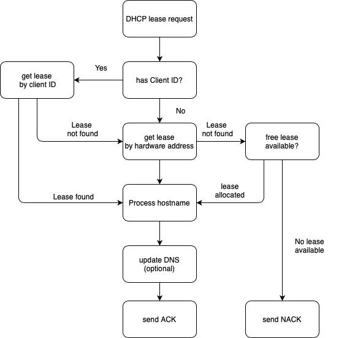

Using the Kea DHCP Server
=========================

## Table of Contents

- [KEA DHCP Part 1](#kea-dhcp-part-1)
  - [Introduction](#introduction)
  - [DHCPv4 Protocol](#dhcpv4-protocol)
  - [DHCPv4 Lease concept](#dhcpv4-lease-concept)
  - [Host Reservation](#host-reservation)
  - [Shared Subnet](#shared-subnet)
  - [DHCPv6](#dhcpv6)
  - [Identity Association (IA)](#identity-association-ia)
- [KEA DHCP Part 2](#kea-dhcp-part-2)
  - [KEA DHCP](#kea-dhcp)
  - [KEA Platforms](#kea-platforms)
  - [KEA hooks](#kea-hooks)
  - [KEA configuration](#kea-configuration)
    - [Network interface configuration](#network-interface-configuration)
    - [Lease database definition](#lease-database-definition)
    - [Subnet and pool definition](#subnet-and-pool-definition)
    - [Logging definition](#logging-definition)
    - [Kea configuration check](#kea-configuration-check)
  - [keactrl](#keactrl)
  - [Testing DHCPv4 with the ISC dhcpclient](#testing-dhcpv4-with-the-isc-dhcpclient)
    - [dhclient as a debugging tool](#dhclient-as-a-debugging-tool)
    - [Performance benchmarking](#performance-benchmarking)
  - [Kea DHCPv6 configuration](#kea-dhcpv6-configuration)
    - [Kea DHCPv6 DUID](#kea-dhcpv6-duid)
- [KEA DHCP part 3](#kea-dhcp-part-3)
  - [DHCP Lease allocation](#dhcp-lease-allocation)
  - [Client Classification](#client-classification)
    - [Where do DHCP identifiers come from](#where-do-dhcp-identifiers-come-from)
    - [Automatic vendor classing](#automatic-vendor-classing)
    - [The KNOWN and UNKNOWN classes](#the-known-and-unknown-classes)
    - [Client classification example](#client-classification-example)
    - [Classification via hooks](#classification-via-hooks)
    - [Debugging client classing](#debugging-client-classing)
  - [DHCP options](#dhcp-options)
    - [Global DHCP options](#global-dhcp-options)
    - [Subnet Specific DHCP option](#subnet-specific-dhcp-option)
    - [Client Class Options](#client-class-options)
    - [Defining Custom DHCPv4 options](#defining-custom-dhcpv4-options)
- [KEA DHCP Part 4](#kea-dhcp-part-4)
  - [Database backend support for Kea](#database-backend-support-for-kea)
    - [Benefits of using a database backend](#benefits-of-using-a-database-backend)
    - [Drawbacks of using a database backend](#drawbacks-of-using-a-database-backend)
  - [High Availability](#high-availability)
    - [Load-balancing Mode](#load-balancing-mode)
    - [Hot-standby Mode](#hot-standby-mode)
    - [Backup Servers Mode](#backup-servers-mode)
    - [Passive-backup Mode](#passive-backup-mode)
    - [Load-balancing vs. Hot-standby](#load-balancing-vs-hot-standby)
    - [HA Configurations](#ha-configurations)
    - [Database synchronization](#database-synchronization)
    - [Retrieving the HA status](#retrieving-the-ha-status)
- [KEA DHCP Part 5](#kea-dhcp-part-5)
  - [Stork Monitoring](#stork-monitoring)
  - [Other Monitoring](#other-monitoring)
    - [Process Monitoring](#process-monitoring)
    - [DHCP Function Monitoring](#dhcp-function-monitoring)
  - [Dealing With Pool Depletion](#dealing-with-pool-depletion)
  - [Logging](#logging)
  - [Performance Testing](#performance-testing)

# KEA DHCP Part 1

## Introduction

This is the study notes from [ISC webinar](https://www.youtube.com/watch?v=zr8kGTcJ5WY)

DHCP is short for Dynamic Host Configuration Protocol. It is addressed in RFC 2131 for IPv4 and RFC 8415 for IPv6.

## DHCPv4 protocol

The DHCPv4 server or relay agents listen on port 67. The DHCPv4 clients listen on port 68 for messages from a server or relay agent.

The communication between a client and a DHCP server follow the DORA procedures.

- DHCPDISCOVER: client asks: is there a DHCP server that can give me an address. This is link layer broadcast traffic because the client doesn’t have IP address and doesn’t know if DHCP server exists.
- DHCPOFFER: DHCP server offers an address to the client
- DHCPREQUEST: the client requests the IP address offered by the server.
- DHCPACK: server marks the IP address as leased and confirms that transaction.

DHCP client has the following state

- init-reboot
- init
- selecting
- bound
- renewing
- rebinding

## DHCPv4 lease concept

When using the DHCP protocol, a client can never keep an IP Address forever. Each IP address given out by a DHCP server has a “lease” time, which is in seconds that the clients is allowed to use the IP address.

The lease time is delivered in a DHCP option as a 32bit value. The max lease time is about 136 years.

According to the RFC, DHCP server must store the lease information to permanent storage before confirming the IP address to a client. This can be a performance bottleneck on a DHCP server.

## Host reservation

DHCP IP address should always be given to the same DHCP client machine. A host reservation binds a DHCP client via a client identifier (MAC address) to an IP address.

## Shared subnet

A shared subnet is a physical network with more than one DHCPv4 managed subnet inside. Shared subnet are sometimes created if a larger number of IP addresses are needed in a network, but because of IPv4 address shortage no continuous range of IPv4 addresses are available.

## DHCPv6

It seems that DHCPv6 works the same way as DHCPv4. However, it is quite different. DHCPv6 is not upgrade version of DHCPv4. It is a protocol of its own.

DHCPv6 is solely a Layer 3 protocol. A DHCPv6 client already has a working link-local IPv6 address (fe80::) when sending the first DHCPv6 request. It is unlike DHCPv4 link layer / ethernet based broadcast.

DHCPv6 clients communicate using link-local multicast addresses. For example

- All-DHCP-Relay-Agents-and-Servers: ff02::1:2
- All-DHCP-Servers: ff05::1:3

DHCPv6 has been designed to provide it’s service in cooperation with the local routers. DHCPv6 must be enabled in the router configuration (M-Flag or O-Flag). The default gateway address will be retrieved from a router and not from the DHCPv6 server.

For DHCPv6 address allocation, DHCPv6 server must issue IP addresses randomly from the available address pool. Unlike some DHCPv4 server issue IP addresses continuously. The DHCPv6 scheme makes it harder to guess an IP address or scan a network segment.

A DHCPv6 client can send different kind of IP address requests. DHCPv6 allocation types are as follows

- Non-temporary
- Temporary
- multiple
- Prefix delegation Unlike DHCPv4, a DHCPv6 is able to request multiple IPv6 addresses.

IPv6 supports Stateless Automatic Address Configuration (SLAAC). SLAAC can be used as an alternative to DHCPv6. Both SLAAC and DHCPv6 can be combined. SLAAC is a stateless configuration that IPv6 address will be determined without a DHCP server. DHCPv6 is a stateful configuration because IPv6 address will be received from a DHCPv6 server.

DHCPv6 is able to rapid commit. It speeds up the process of joining a network. With rapid commit, there is no information send to the DHPCv6 server telling the server whether the client is using the advertised IPv6 address.

## Identity Association (IA)

An identity association is a construct through which a server and a client can identify, group, and manage a set of related IPv6 addresses or delegated prefixes.

Each IA consists of an Identity Association ID (IAID), and associated configuration information.

If a client has more than one network interface, every interface will be associated with one distinct IAID.

DHCPv6 clients can receive temporary and non-temporary addresses. Temporary and non-temporary (stable) IPv6 addresses are managed with the help of IAID.


# KEA DHCP Part 2

Some of contents are from ISC KEA document listed in Reference section.

## KEA DHCP

KEA is modern DHCPv4 and DHCPv6 server. It is under open source MPL License. It provides JSON/REST API and modular design. It also provides high performance, which is able to have 1000 leases/seconds.

KEA supports for DHCPv6 prefix delegation, dynamic reconfiguration, dynamic DNS updates, SQL database backend and PXE Boot support.

## KEA platforms

The following OS are able to run KEA
- CentOS, Fedora,
- MacOS X
- Alpine Linux
- OpenBSD Unix But not for Windows

## KEA hooks

The base KEA software implements the basic DHCPv4 and DHCPv6 functions. The hooks are libraries that contain extra functions that will be called when a DHCP request is processed.

Hooks allow the core Kea system to stay lean, installations only load the functions used and needed. This reduces the complexity and the attack surface of an installation. Hooks that are part of the KEA open source code (source and binary packages)

## KEA configuration

Configuration files for the DHCPv4, DHCPv6, DDNS control agent and netconf modules are defined in an extended JSON format. JSON was defined in RFC 7159 and ECMA 404. JSON Editor understands the JSON format. It can check the syntax and can highlight and reformat JSON data.

Extended JSON: Kea components use an extended JSON with addition features.
- Shell comments:
- C comments:
- Multiline comments:
- File inclusion:

KEA configuration files include kea-dhcp4.conf, kea-dhcp6.conf, kea-dhcp-ddns.conf, kea-ctrl-agent.conf and keactrl.conf.

The following sections are examples of configuration section inside the config file.

### Network interface configuration

```bash
  "interfaces-config": {
            "interfaces": [
                "*"
            ],
            "re-detect": true,
            "dhcp-socket-type": "raw",
            "outbound-interface": "same-as-inbound"
        },
```

The DHCPv4 server must be configured to listen on specific network interfaces. The simplest network interface configuration tells the server to listen on all available interfaces. The asterisk plays the role of a wildcard and means “listen on all interfaces.”

The dhcp-socket-type specifies that the IP/UDP sockets will be opened on all interfaces on which the server listens, i.e. “eth1” and “eth3” in our case. If dhcp-socket-type is set to raw, it configures the server to use raw sockets instead. If the dhcp-socket-type value is not specified, the default value raw is used.[1]

Interfaces are re-detected at each reconfiguration.

### Lease database definition

```bash
 "lease-database": {
            "type": "memfile",
            "persist": true,
            "name": "/var/leases/dhcp4.leases",
            "lfc-interval": 3600
        },
```

The lease database is the place where the server stores its lease information. This particular example tells the server to use memfile, which is the simplest (and fastest) database backend. It uses an in-memory database and stores leases on disk in a CSV (comma-separated values) file. This is a very simple configuration; usually the lease database configuration is more extensive and contains additional parameters. Note that lease-database is an object and opens up a new scope, using an opening brace. Its parameters (just one in this example: type) follow. If there were more than one, they would be separated by commas. This scope is closed with a closing brace. As more parameters for the DHCPv4 definition follow, a trailing comma is present.

### Subnet and pool definition
```bash
 "subnet4": [
            {
                "valid-lifetime": 3600,
                "subnet": "172.28.4.0/24",
                "match-client-id": true,
                "pools": [
                    {
                        "pool": "172.28.4.1 - 172.28.4.200"
                    }
                ],
```

We need to define a list of IPv4 subnets. This is the most important DHCPv4 configuration structure, as the server uses that information to process clients’ requests. It defines all subnets from which the server is expected to receive DHCP requests. The subnets are specified with the subnet4 parameter. It is a list, so it starts and ends with square brackets. Each subnet definition in the list has several attributes associated with it, so it is a structure and is opened and closed with braces. At a minimum, a subnet definition has to have at least two parameters: subnet (which defines the whole subnet) and pools (which is a list of dynamically allocated pools that are governed by the DHCP server).

### Logging definition

KEA DHCP has comes with a flexible and powerful logging framework. The configuration snippet below configures a log-file for the DHCPv4 service.

```bash
 "Logging": {
        "loggers": [
            {
                "name": "kea-dhcp4",
                "output_options": [
                    {
                        "output": "syslog:user"
                    }
                ],
                "severity": "INFO",
                "debuglevel": 0
            },
            {
                "name": "kea-dhcp4.leases",
                "output_options": [
                    {
                        "output": "/var/log/kea-dhcp4-leases.log"
                    }
                ],
                "severity": "INFO",
                "debuglevel": 0
            },
```

### Kea configuration check
```bash
kea-dhcp4 -t /etc/kea/kea-dhcp4.conf
```

## keactrl

keactrl is a shell script that can be used to control the KEA services. The care must be taken not to conflict with process supervision services such as systemd, runit or s6.

keactrl has a configuration, which lists the location of the configuration files and the kea binaries.

To check Kea DHCP service status

```bash
keactrl status
```

keactrl reload when change the configuration file

```bash
keactrl reload -c keactrl.conf
```

## Testing DHCPv4 with the ISC dhcpclient

Most Linux distributions provide the ISC DHCP client tool dhclient. This tool can be used as an simple DHCP debugging tool.

### dhclient as a debugging tool

Create a new shell script in /usr/local/sbin/dhclient-debug.sh with the lines below

```bash
#!/bin/sh
env
```

Then, make it executable

```bash
chmod 755 /usr/local/sbin/dhclient-debug.sh
```

Execute the dhclient tool with this script

```bash
dhclient -sf /usr/local/sbind/dhclient-debug.sh
```

The script will print out all the information received from the DHCP server (via environment variables). It will not reconfigure the client machines network stack.

### Performance benchmarking

Kea comes with a DHCP benchmarking tool: perfdhcp. This tool can be used to benchmark Kea, but also other DHCP server systems. For details, see the perfdhcp document.

## Kea DHCPv6 configuration

The Kea DHCPv6 server is independent from the Kea DHCPv4 server. Both can be started together on the same machine, or separated machines. The configuration file for the Kea DHCPv6 server is kea-dhcp6.conf. The Kea DHCPv6 server can be controlled from the keactrl script or through systemd (on Linux).

### Kea DHCPv6 DUID

Each DHCPv6 server has a unique DHCP-Unique-ID (DUID). When re-installing a DHCPv6 server, it might be useful to backup and restore the DUID of the system. The Kea DHCPv6 DUID is stored in the file kea-dhcp6-serverid in the /var/lib/kea directory.


# KEA DHCP part 3

## DHCP lease allocation

When DHCP lease request is received, after Kea server successfully granted a lease, the following log is generated.

```bash
2020-10-15T20:35:36.137822+00:00 onprem-dhcp-6c98f7f9d9-lxd5d kea-dhcp4: INFO  [kea-dhcp4.leases] DHCP4_LEASE_ALLOC [hwtype=1 10:7d:b9:2f:0d:eb], cid=[no info], tid=0x1: lease 172.17.10.1 has been allocated
```

This informational message indicates that the server successfully granted a lease in response to client’s DHCPREQUEST message. The lease information will be sent to the client in the DHCPACK message.

The first argument contains the client and the transaction identification information. The second argument contains the allocated IPv4 address. The third argument is the validity lifetime.

The following diagram illustrated the simplified process of Kea lease allocation.

<p align="center" width="100%">
     
</p>

When searching for a new lease, Kea 1.8 iterates over all subnets by subnet-id, previous versions iterated over subnets in config file order. In the example above, lease is not found by client ID, so Kea server gets lease by hardware address.

## Client Classification

Kea DHCP can assign on or more client classes to client requests. Depending on the client classes, different DHCP information can be send to the client: DHCP-Options, IP-Addresses, BOOTP-Parameter inside DHCP responses Kea can select from multiple subnets / pools with the help of client classes.

### Where do DHCP identifiers come from

Client classes can be build from various DHCP identifier

- information from client host
- information from DHCP relay
- information from DHCP packet path towards the DHCP server

The DHCP identifiers could come from the client host, including hardware address, client-id, vendor-option and hostname. It also could come from DHCP relay agent to add more options. Finally, it could come from DHCP server itself to add DHCP server interface, and DHCP server destination address, etc.

### Automatic vendor classing

Kea DHCP automatically assigns a vendor client class if a vendor option (DHCPv4 option 60 or DHCPv6 option 16) is set in the DHCP request.

The content of that option is prepended with VENDOR_CLASS_ and the result is interpreted as a class. For example, modern cable modems send this option with value docsis3.0, so the packet belongs to class VENDOR_CLASS_docsis3.0.

Example subnet selection based on the vendor option

```bash
"subnet4": [
    {
        "subnet": "192.168.2.0.24",
        "client-class": "VENDOR_CLASS_fedoraLinux",
        "option-data": [{
            "name": "routers", "data": "192.168.2.1" }],
        "pools" : [{
            "pool": "192.168.2.60 - 192.168.2.220" }]

    },
]
```

### The KNOWN and UNKNOWN classes

Kea automatically assigns classes based on host reservations.

- all clients with a host reservation will be in the KNOWN class
- all client without reservation will be in the UNKNOWN class

For example

```bash
{
    "client-classes": [{
        "name": "dependent-class",
        "test": "member('KNOWN')",
        "only-if-required": true
    }]
}
```

### Client classification example

Configuration for dynamic client classing based on the vendor option (Option 60) content

```bash
{
    "client-classes": [
        {
            "name": "windows",
            "test": "substring(options[60].hex,0,3) == 'win'",
            "option-data": [{
                "name": "domain-name", "data": "win.example.com" }]
        }
    ]
}
```

### Classification via hooks

Client classification via complex expressions can hurt the DCHP server performance. Alternative: writing a custom hook for client classification.

### Debugging client classing

To debug client classing, the quick option is to enable debugging level when start KEA DHCP4.

```bash
kea-dhcp4 -d -c /etc/kea/kea-dhcp4.conf
```

Alternatively, we can enable the special kea-dhcp4.eval or kea-dhcp6.eval debug logger in the KEA configuration file

```bash
"Logging": {
    "loggers": [ {
        "name": "kea-dhcp4.eval",
        "output_options": [ {
            "output": "/var/log/kea-dhcp4-eval.log"
        } ],
        "severity": "DEBUG",
        "debuglevel": 55
    }]
}
```

The debuglevel ranges from 0 (least verbose) to 99 (most verbose). If severity for the logger is not DEBUG, this value is ignored.

## DHCP options

DHCP options can be configured in different scopes in the Kea configuration, global, class, subnet, pools, reservations

### Global DHCP options

```bash
"Dhcp4": {
    "option-data": [{
        "name": "domain-name-servers",
        "code": 6,
        "space": "dhcp4",
        "csv-format": true,
        "data": "192.168.1.1, 192.168.1.2"
    }]
}
```

### Subnet Specific DHCP option

```bash
    "subnet4": [ {
        "subnet": "192.168.1.0/24",
        "pools": [ { "pool": "192.168.1.100 - 192.168.1.200" }],
        "option-data": [{
            "name": "routers",
            "data": "192.168.1.1" 
        },
        {
            "name": "domain-name",
            "data": "a.example.com" 
        }]
    }],
```

### Client Class Options

```bash
"client-classes": [{
    "name": "My-Server",
    "test": "option[vendor-class-identifier].text == 'My'",
    "option-data": [ {
        "name": "log-servers",
        "data": "192.168.1.30"
    }]
}]
```

### Defining Custom DHCPv4 options

Sometimes it is required to define custom DHCP options that are not part of the DHCP standards.

```bash
{
    "Dhcp4": {
        "option-def": [{
            "name": "my-message",
            "code": 234,
            "type": "string",
            "array": false,
            "record-types": "",
            "space": "dhcp4",
            "encapsulate": "" }],
        "option-data": [{
            "name": "my-message",
            "space": "dhcp4",
            "csv-format": true,
            "data": "My customized DHCP message" 
        }]
    }
}
```


# KEA DHCP Part 4

## Database backend support for Kea

Kea DHCP server can store information in a database, including lease info, host address and prefixes, host options, host names and host classification. Only MySQL supports to store configurations.

The supported database are Postgres, MySQL/MariaDB, Cassandra and Redis.

The configuration example to use postgresql as DB.

```bash
"lease-database": {
    "type": "postgresql",
    "name": "kea_lease_db",
    "user": "kea",
    "password": "secure-password",
    "host": "localhost"
}
```

### Benefits of using a database backend

- Faster turn-around for configuration changes in large deployments.
- Easy access to DHCP info from scripts.
- High-Availability through database redundancy.
- Easier to integrate into existing backup systems.

### Drawbacks of using a database backend

When issuing a lease, Kea DHCP must wait for the storage backend to acknowledge the successful storage of lease information. Some databases cannot store lease information that reaches beyond the year 2038

## High Availability

The HA hook offers different operation modes.

- load-balancing: all DHCP server are active and return leases.
- hot-standby: all DHCP server are in sync but only one is active and returns leases.
- passive-backup: one DHCP server is active and send lease database updates to a number of backup servers.

### Load-balancing Mode

When operating in load-balancing mode, two KEA DHCP server are active and respond to lease requests. The lease information is synced between the KEA DHCP HA servers by TCP port 649. The pool are split 50/50 between the two DHCP servers. Every DHCP server can take over the full services if needed. Via the HA protocol, a DHCP HA node will detect if one partner node is down and takes over the service.

The configuration looks like

```bash
{
"library": "/usr/lib/kea/hooks/libdhcp_ha.so", "parameters": {
    "high-availability": [{
        "this-server-name": "server1",
        "mode": "load-balancing",
        "heartbeat-delay": 10000, "max-response-delay": 40000, "max-ack-delay": 5000,
        "max-unacked-clients": 5,
        "peers": [{
            "name": "server1",
            "url": "http://192.0.2.33:8000/",
            "role": "primary", "auto-failover": true
        }, {
            "name": "server2",
            "url": "http://192.0.2.66:8000/",
            "role": "secondary", "auto-failover": true
        }, {
            "name": "server3",
            "url": "http://192.0.2.99:8000/",
            "role": "backup",
            "basic-auth-user": "foo", "basic-auth-password": "bar",
            "auto-failover": false
}] }]
}
```

### Hot-standby Mode

A KEA DHCP cluster configured for the hot-standby mode will have the primary node serving DHCP clients and another node only receiving the lease-database updates, but not serving clients.

The configuration looks like

```bash
{
"library": "/usr/lib/kea/hooks/libdhcp_ha.so", "parameters": {
   "high-availability": [      "this-server-name": "server1",
       "mode": "hot-standby",
       "heartbeat-delay": 10000, "max-response-delay": 40000,
       "max-ack-delay": 5000,    "max-unacked-clients": 5,
       "peers": [{
           "name": "server1",
           "url": "http://192.0.2.33:8000/",
           "role": "primary", "auto-failover": true
       }, {
           "name": "server2",
           "url": "http://192.0.2.66:8000/",
           "role": "standby", "auto-failover": true
       }, {
           "name": "server3",
           "url": "http://192.0.2.99:8000/",
           "basic-auth-user": "foo",  "basic-auth-password": "bar",
           "role": "backup",  "auto-failover": false
}] }]
}
```

### Backup Servers Mode

KEA DHCP supports an number of backup servers. They receive lease database updates but are not an active part of an HA setup. Backup server can be deployed in addition to the other KEA HA modes.

### Passive-backup Mode

Only one KEA server is active and is serving lease to the clients. In case of an failure of the active server, a backup server needs to be manually promoted to be active.

### Load-balancing vs. Hot-standby

The hot-standby mode is simpler. Only one active server, one active log file, and no split pools required.

However, in the load-balancing mode, the load is distributed across both active DHCP servers, with complex client classing rules. The load-balancing mode requires a 50/50 split of the pools across both HA server nodes.

### HA Configurations

The KEA HA configuration parts are symmetric, all HA peers can share an almost identical configuration file. The only difference in the HA configuration is the this-server-name parameter. The HA mode is selected with mode parameter.

Depending on the mode, the server role can be defined as primary, standby or backup.

### Database synchronization

The ha-sync command triggers the server to sync lease database with the selected peer

```bash
{   "command": "ha-sync",
    "service": [ "dhcp4 "],
    "arguments": {
        "server-name": "server2",
        "max-period": 60
    }
}
```

### Retrieving the HA status

The command ha-heartbeat can be used to check the current state of a KEA DHCP server HA node. The returned JSON structure describes the current DHCP server state.


# KEA DHCP Part 5

This blog is a study note of using Kea DHCP Webinar 05. It introduced Stork monitoring tool, logging and performance test tool, very briefly.

## Stork Monitoring

Stork is a graphic dashboard for Kea DHCP server. It monitors Kea and Kea HA state. It alerts failures, fault conditions and other unwanted events. However, it is under active development.

Stork can be installed to various platforms, including Ubuntu, Fedora and RedHat. This post will ignore Stork installation.

In addition, the Stork user management provides the basic management dashboard. Infoblox IPAM DHCP service actually provide more sophisticated management for Kea DHCP server.

## Other Monitoring

### Process Monitoring

systemd exposes the state of managed services via the DBUS API, so a monitoring system can read the DBUS API information. For example, Prometheus exporter for systemd services.

### DHCP Function Monitoring

dhcping is a simple tool to test if a DHCP server responds to DHCP requests and returns a lease. It requests a lease (DHCPREQUEST) or DHCP option information (DHCPINFORM) from a DHCP Server.

## Dealing With Pool Depletion

If we encounter address pool depletion, check the following reasons:

- lease time too high for the number of DHCP clients in the network.
- machines are not releasing their lease on shutdown.
- malicious/buggy DHCP client software.

The solution is to consider to switch to DHCPv6.

## Logging

All Kea services provide flexible logging. It can output log to syslog, to a file, or to stdout or stderr. The logging config section may looks like below.

```bash
"Logging": {
        "loggers": [
            {
                "name": "kea-dhcp4",
                "output_options": [
                    {
                        "output": "syslog:user"
                    }
                ],
                "severity": "INFO",
                "debuglevel": 0
            },
            {
                "name": "kea-dhcp4.leases",
                "output_options": [
                    {
                        "output": "syslog:user"
                    }
                ],
                "severity": "INFO",
                "debuglevel": 0
            },
            {
                "name": "kea-dhcp4.alloc-engine",
                "output_options": [
                    {
                        "output": "syslog:user"
                    }
                ],
                "severity": "INFO",
                "debuglevel": 0
            },
            {
                "name": "kea-dhcp4.ddns",
                "output_options": [
                    {
                        "output": "syslog:user"
                    }
                ],
                "severity": "INFO",
                "debuglevel": 0
            }
        ]
    }
```

## Performance Testing

perfdhcp is used to do DHCP performance testing for Kea. The usage examples can be available from here.

## References

[ISC KEA configuration](https://kea.readthedocs.io/en/kea-1.6.2/arm/dhcp4-srv.html#interface-configuration)


